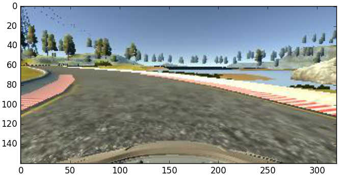
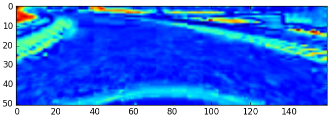

CarND-Behavioral-Cloning

My behavioral cloning project from Udactiy's Self-Driving Car Nanodegree.

## Data

Initially, I collected over 50,000 images using the simulator's recording feature. I drove 4 times around the center of the first track, and an additional two times creating "recovery" images to help the car recover from the side of the road. I also did this with the second track. After recording all of this, I looked through the csv that had recorded my steering angles, and found that the angles either had a zero value or a sharp angle. In my inital model training, the car made a sharp turn off the left side of the track. I realized that I would need to improve my data significantly, or else it would be a garbage-in garbage-out scenario. Although I looked at different input options with a toggle (ie. Wii remote) to create smooth steering angles, I found that Udacity had released its own data set with only about 8,000 center frames and corresponding left and right frames for track one.

To prepare the Udacity dataset for processing and training my model, I resized and cropped the images, converted the color channels from RGB to HSV and only kept the S (Saturation) channel, and normalize the pixel values between -.5 and .5. I resized the image to decrease the amount of data that the nueral network would need to process. I cropped the image to reduce irrelavent noise (trees, mountains, clouds, etc.) from the top third of the and focus my model on just the road, with the added benefit of further reducing the amount of data to process. I change the RGB channels to HSV, and keep only the S channel (saturation) to essentially remove the effect of brightness (shadows, road color, etc) in the image. Decreasing 3 channels to 1 for each pixels also cuts down the amount of data to be processed by two-thirds. Finally, I normalize the pixel values between values of -.5 and .5 to remove extremes in the data, which can cause accuracy issues in calculations. 

By doing this we end up with an image transformation that looks like the following:

*image_caption*

  

The dataset as a whole contained patterns that would train biases into the model that would cause a car to constantly drive off the left side of the road. Since the race track was circular and a majority of the turns were left, the model learned a bias towards turning left, since a left turn angle would usually result in a more accurate prediction than a right or straight angle. In order to remedy this, I made a copy and flipped the copy of each image in my dataset, and added a flipped steering angle to correspond with the flipped image. This balanced the dataset to have the exact same number of right turn images as left turn images. 

When the car approached the side of the track, I noticed that it slowly tried to correct itself, but much too slowly. Looking through the distribution of steering angles in the data, I found disproportionate amount of zero value steering angles in the dataset. See distribution below.

*image_caption*

This created another bias in the trained model, where the model was rewarded for steering angles closer to zero value. So although, the model recognizes that it needs to make a sharp left turn, it uses lower values, since zero values generally gave higher prediction accuracies. To fix this, I removed 70% of the zero values so that the distribution looked like this:

*image_caption*

To further help the model recover the driving path towards the middle as it nears the edge of the road, I intentionally biased the steering angles associated with the images taken from the left and right perspectives of the car. I added an angle of .15 degrees to the steering angle of the left image and subtracted .15 degrees from the steering angle of the right image. This forced a biase toward the center of the road, which allows this car to correct itself as it approaches one side or another.

In my final steps of preparing the data to train my model, I shuffle the data and split it into 80% training and 20% validation data.

##Model

In search for a good starting point model, I researched two different models that deal essentially the same challenge of training a car to steer within a lane. These two models are George Hotz's Comma.ai model and the Nvidia model explained in the "End to End Learning for Self Driving Cars" document that Udacity linked me to.

The Comma.ai approach is structured with 1 normalization layer, 3 convolutional layers, and 2 fully connected layers. Of note, it makes use of ELU (Exponential Linear Units) activations after each layer, which brings the mean activation of each nueron closer to zero than a regular ReLU. It also uses a surprisingly low dropout value of .2 on its first fully connected layer, and a dropout of .5 on the second layer, which significantly lowers the chances of overfitting. The Comma.ai approach also uses over 200 Epochs on this relatively simple architecture.

The Nvidia approach uses 1 normalization layer, 4 convolutional layers and 3 fully connected layers. Of note, Nvidia used 5 x 5 kernal sizes with a stride of 2 x 2 for each of the first 3 convolutional layers, and decreased the kernal size to 3 x 3 with no stride on the last convolutional layer. This model only needs a few epochs to train the network.

After trying both models with the preprocessed data, I found that the Nvidia model gave me better initial results while taking less time to train. However, I liked features of the Comma.ai approach, so I incorporated a few features into the Comma.ai model into the Nvidia model that I used as a base. My model, like the Nvidia model, has 4 convolutional layers and 3 fully connected layers, with the same sized kernels and strides as the Nvidia model specified. However, I incorporated Comma.ai's use of ELU activation layers between each of the convolutional layers as well as the fully connected layers. I included dropout layers between each of the fully connected layers, with a .2 dropout value after the first fully connected layer and .5 dropout values after the following two fully connected layers.

With additional research, I was able to find that Keras had a built in BatchNormalization layer that I could include, which normalizes and regularizes the inputs to each layer. This decreases internal covariate shift and essentially allows us to use much higher learning rates and be less careful about initialization. For this reason, I used BatchNormalization before each ELU activation in my model.

##Results

I received a final training loss of 0.0514 and a validation loss of 0.0543. Qualitatively, the model drives the car well on both tracks (best performance at smallest resolution and lowest graphics), without ever crashing or venturing into dangerous areas.